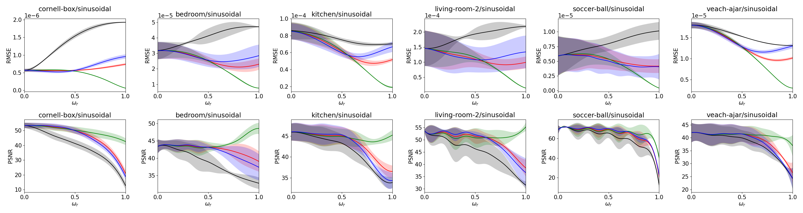
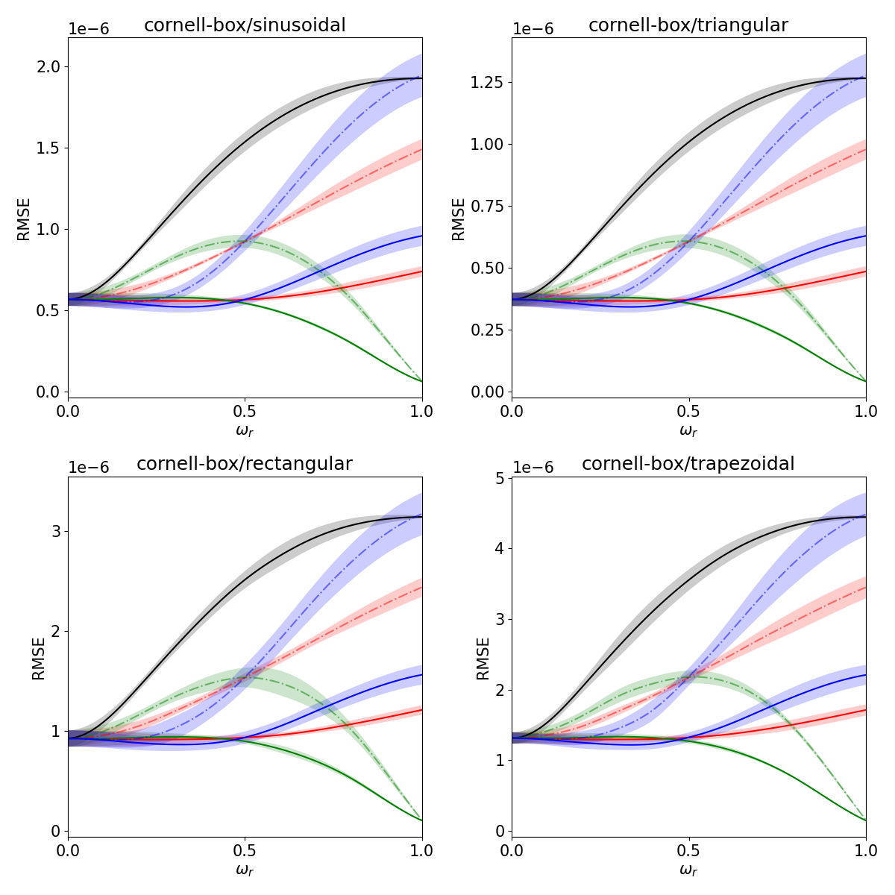
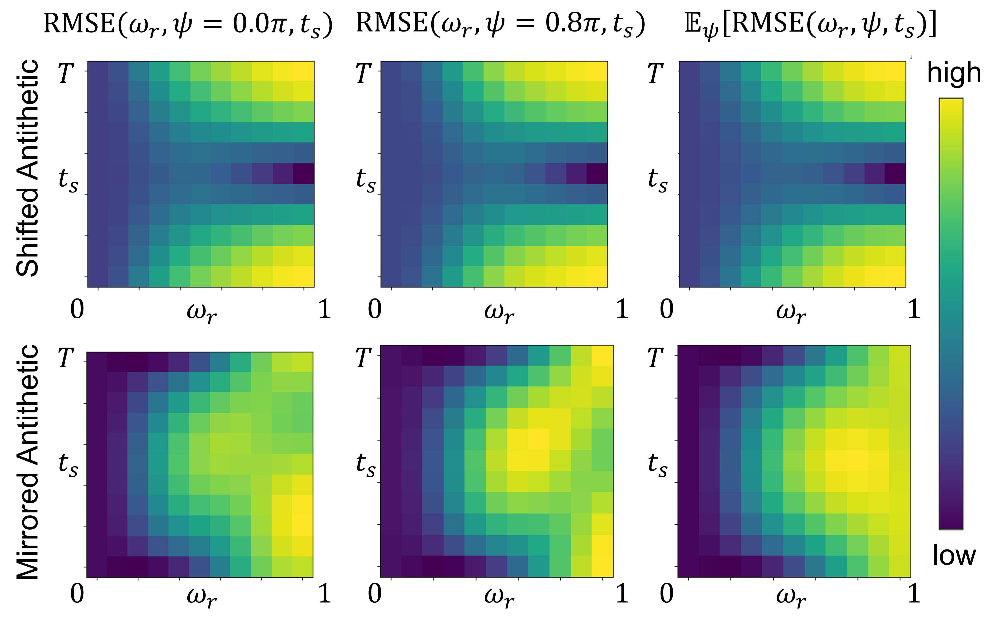

Mitsuba3 Doppler Time-of-Flight Renderer Tutorial
===================================
## About
We provide several tutorials for Doppler ToF rendering.
The required data could be downloaded at [here](https://drive.google.com/drive/folders/1S8S00v0vHaQAwSI-Xs-g4Q-FE8tH2hSN?usp=drive_link).
`scenes` folder is used for main experiment while `scenes_animation` is used for animation simulation.

In `main_experiment.py`, you can find some predefined experiments.
You can also find corresponding .sh file.

* Experiment 0 : This experiment creates ground truth image.
* Experiment 1 : This experiment compares several different time sampling methods (uniform, stratified, antithetic, antithetic_mirror). Note that further stratification is set true.
* Experiment 2 : This experiment compares effect of further stratification. In other word, it repeats experiment 1 without further stratification.
* Experiment 3 : This experiment compares effect of different antithetic shifts.

After rendering the images, you can run `main_plot.py` for visualization.

Here is example of each plot.

* Experiment 1: This corresponds to Figure 11 in the main paper.

* Experiment 2: This corresponds to Figure 13 in the main paper.

* Experiment 3: This corresponds to Figure 14 in the main paper. Note that experiment 3 outputs not a pyplot window, but only png files.

We also provide animation simulation in `main_animation.py`.

